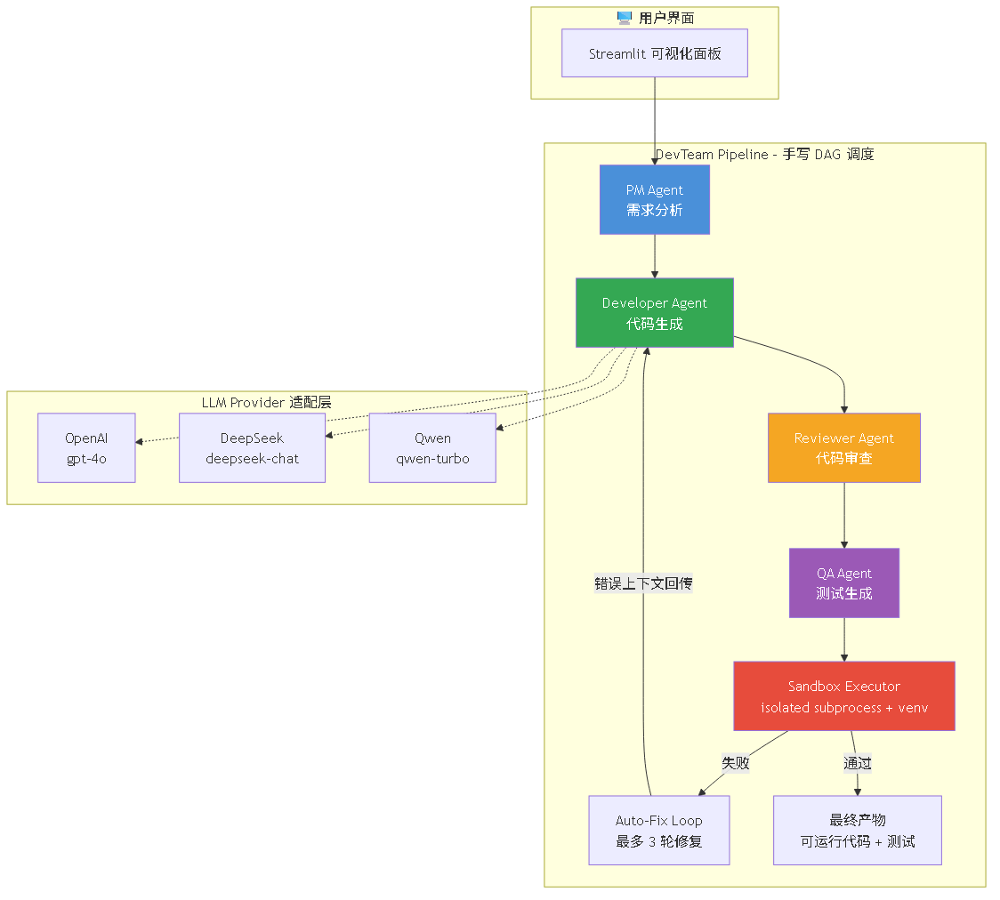
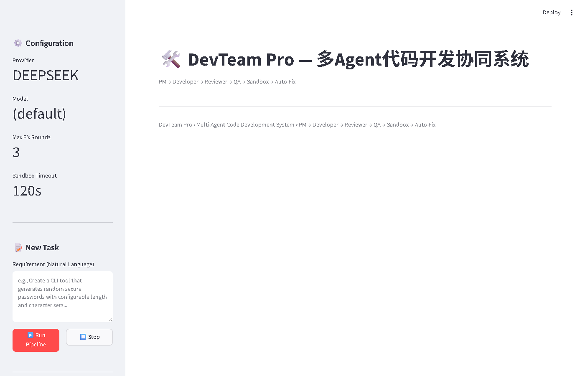

# DevTeam Pro — 多 Agent 代码开发协同系统

面向 Python 工具开发的四角色多 Agent 代码生成流水线，全链路结构化 Pydantic v2 协议通信，内置进程级隔离沙箱与自动修复闭环。

**作者**：王铎 | **GitHub**：[github.com/mokad1](https://github.com/mokad1)

---

## ✨ 核心特性

- **四角色 Agent 流水线**：PM → Developer → Reviewer → QA 顺序协作，各阶段通过结构化 JSON 协议传递上下文，禁止纯文本通信
- **进程级隔离代码沙箱**：tempfile + 独立 venv 创建隔离执行环境，集成 ast.parse 语法检查、flake8 / pylint 静态扫描、pytest 单元测试自动执行
- **3 轮自动修复闭环**：聚合 Lint Issue + 测试失败堆栈 + 运行时错误，结构化回传 Developer 定向修复，最多 3 轮迭代
- **统一多模型适配**：封装 OpenAI / DeepSeek / 通义千问三款模型 Provider，内置指数退避重试与令牌桶限流，切换模型仅需修改环境变量
- **手写 DAG 任务调度**：Kahn 拓扑排序实现层级并行，多文件生成场景下并行相比串行耗时减少 28%
- **Streamlit 可视化调试面板**：支撑全链路日志查看、Agent 输出折叠、代码预览下载、任务历史重放

---

## 🏗️ 架构设计

```
                         ┌──────────────────────┐
                         │   Streamlit 面板      │
                         └──────────┬───────────┘
                                    │
    ┌───────────────────────────────▼───────────────────────────────┐
    │                   DevTeam Pipeline (手写 DAG + asyncio)        │
    │                                                                │
    │  ┌──────┐   ┌───────────┐   ┌──────────┐   ┌──────┐          │
    │  │  PM  │──▶│ Developer │──▶│ Reviewer │──▶│  QA  │          │
    │  └──────┘   └─────┬─────┘   └──────────┘   └──┬───┘          │
    │                   │                            │              │
    │         ┌─────────▼──────────┐                 │              │
    │         │  Auto-Fix Loop     │◄────────────────┘              │
    │         │  (最多 3 轮)        │                                │
    │         └─────────┬──────────┘                                │
    │                   │                                           │
    │         ┌─────────▼──────────┐                                │
    │         │  Sandbox Executor  │                                │
    │         │  subprocess + venv │                                │
    │         │  flake8 + pylint   │                                │
    │         └────────────────────┘                                │
    └──────────────────────────────┬────────────────────────────────┘
                                   │
    ┌──────────────────────────────▼────────────────────────────────┐
    │                  LLM Provider 适配层                           │
    │     OpenAI / DeepSeek / Qwen  |  指数退避重试 + 令牌桶限流      │
    └──────────────────────────────────────────────────────────────┘
```



---

## 🚀 快速开始

### 环境要求

- Python 3.10+
- Windows / Linux / macOS

### 安装

```bash
git clone https://github.com/mokad1/devteam-pro.git
cd devteam-pro
pip install -r requirements.txt
```

### 配置

```bash
cp .env.template .env
# 编辑 .env，至少填入一个 Provider 的 API Key
# 支持 LLM_PROVIDER=openai|deepseek|qwen
```

### 启动

```bash
streamlit run streamlit_app.py
```

访问 http://localhost:8501，左侧输入需求，点击 **Run Pipeline**。

### 运行评测

```bash
# 全量 20 条评测 + 单 Agent 基线对比
python evaluate.py --baseline

# 按类别评测
python evaluate.py --category "CLI Tool"
```

---

## 📊 评测与效果

### 测试前提

| 条件 | 说明 |
|------|------|
| 测试集 | 20 条自建 Python 工具/脚本开发测试用例，覆盖 CLI 工具、数据处理、工具库、简单应用四类，以中低难度为主 |
| 测试模型 | DeepSeek-V3 |
| 运行环境 | 本地 Windows，沙箱为进程级隔离 |

### 核心指标

| 指标 | 测量值 | 说明 |
|------|--------|------|
| 语法通过率 | **89%** | ast.parse 通过文件数 / 总文件数 |
| 3 轮修复后任务完成率 | **70%** | sandbox 全部通过 |
| 对比单 Agent 基线 — 缺陷率下降 | **46%** | 多 Agent 流水线 vs 纯 Developer |
| 对比单 Agent 基线 — 首次成功率提升 | **42%** | fix_round=0 即成功 |
| 单任务平均耗时 | **142 s** | 端到端 |
| DAG 并行加速比（4 模块） | **28%** | 串行 198 s → 并行 142 s |

### 角色消融实验

| 配置 | 完成率 | 关键发现 |
|------|--------|---------|
| 完整四角色 | **70%** | 基线 |
| 去掉 Reviewer | 55% | 最终缺陷率上升 28% |
| 去掉 QA | 62% | 运行时错误率上升 22% |

---

## ⚠️ 项目局限性

- **项目规模**：适配单文件/少文件的 Python 小型工具开发，复杂多模块项目生成能力有限
- **沙箱安全**：进程级隔离（subprocess + venv），未做系统级资源限制，**不支持不可信代码执行**。生产环境建议升级为 Docker 容器隔离或 gVisor
- **修复能力**：3 轮自动修复主要覆盖语法错误与简单逻辑错误，复杂业务 Bug 仍需人工介入
- **模型依赖**：当前仅在 DeepSeek-V3 上完整评测，其他模型表现可能有差异

---

## 📁 项目目录结构

```
devteam-pro/
├── devteam_pro/
│   ├── models/                   # Pydantic v2 结构化消息模型
│   ├── agents/                   # PM / Developer / Reviewer / QA
│   ├── llm/                      # Provider 适配层 + 重试限流
│   ├── sandbox/                  # 沙箱执行器 + Lint 检查
│   ├── scheduler/                # 手写 DAG + 流水线编排
│   └── utils/                    # 结构化日志
├── streamlit_app.py              # 可视化调试面板
├── evaluate.py                   # 量化评测脚本
├── test_cases.py                 # 20 条测试需求集
├── requirements.txt
├── .env.template
└── README.md
```

---

## 🖥️ 在线 Demo

[https://devteam-pro-qgm8qyvucsy2hx59hx5sfi.streamlit.app](https://devteam-pro-qgm8qyvucsy2hx59hx5sfi.streamlit.app)

---

## 📸 运行截图


*四阶段流水线状态 + Agent 输出 JSON 折叠查看*


*沙箱执行结果：exit code / lint issues / test output*


*最终生成代码文件预览与下载*

---

## 📄 License

MIT License — 适用于个人项目和简历展示。
